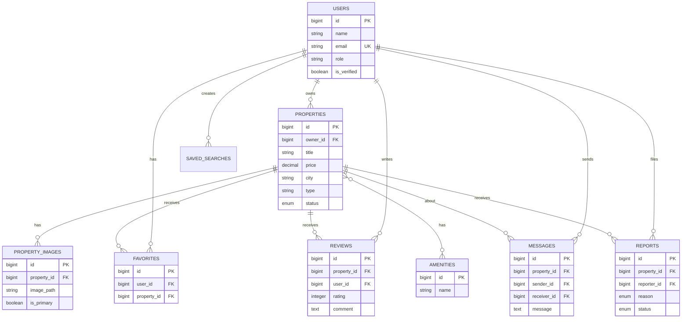

# 🏠 Production-Ready Rental Property Platform - Complete Laravel Guide

> **A comprehensive, production-ready rental marketplace connecting property owners with renters**

---

## 📋 Table of Contents

1. [Project Vision](#1-project-vision)
2. [Core Features](#2-core-features)
3. [Advanced Features](#3-advanced-features)
4. [Tech Stack](#4-tech-stack)
5. [System Architecture](#5-system-architecture)
6. [Database Schema](#6-database-schema)
7. [Service Layer & Repository Pattern](#7-service-layer--repository-pattern)
8. [Authentication & Authorization](#8-authentication--authorization)
9. [Property Management Implementation](#9-property-management-implementation)
10. [Search & Filtering System](#10-search--filtering-system)
11. [Map Integration](#11-map-integration)
12. [Image Upload & Storage](#12-image-upload--storage)
13. [Favorites System](#13-favorites-system)
14. [Reviews & Ratings](#14-reviews--ratings)
15. [Messaging System](#15-messaging-system)
16. [Recommendation Engine](#16-recommendation-engine)
17. [Notification System](#17-notification-system)
18. [Admin Dashboard](#18-admin-dashboard)
19. [UI/UX Design & Wireframes](#19-uiux-design--wireframes)
20. [Security Best Practices](#20-security-best-practices)
21. [SEO Optimization](#21-seo-optimization)
22. [API Development](#22-api-development)
23. [Testing Strategy](#23-testing-strategy)
24. [MVP Definition](#24-mvp-definition)
25. [Development Timeline](#25-development-timeline)
26. [Monetization Strategy](#26-monetization-strategy)
27. [Product Roadmap](#27-product-roadmap)
28. [Deployment & DevOps](#28-deployment--devops)

---

## 1️⃣ Project Vision

### 🎯 Mission Statement

Build a **modern, fast, and secure rental marketplace** that seamlessly connects property owners with potential renters through an intuitive, feature-rich platform.

### 🌟 Core Values

- **User-Centric Design**: Clean UX that prioritizes user needs
- **Performance**: Fast page loads, optimized queries, efficient caching
- **Security**: Industry-standard security practices
- **Scalability**: Architecture ready for growth
- **SEO-Friendly**: Optimized for search engines from day one
- **Mobile-Ready**: Responsive design, API-first for future mobile apps

### 🎨 Brand Identity

- **Modern & Professional**: Clean, minimalist design
- **Trustworthy**: Build confidence through transparency
- **Accessible**: Easy to use for all user types
- **Fast**: Instant search results, smooth interactions

---

## 2️⃣ Core Features

### 👤 User Authentication

- **Multi-Role System**
  - Property Owners
  - Renters
  - Administrators
- **Registration & Login**
  - Email/Password
  - Social Login (Google, Facebook)
  - Email Verification
  - Password Reset
- **Profile Management**
  - Avatar upload
  - Contact information
  - Verification badges

### 🏘️ Property Listings

Each property includes:

- **Multiple Images** (up to 20 photos)
- **Pricing Information**
  - Monthly/Yearly rent
  - Deposit amount
  - Utilities included/excluded
- **Location Data**
  - Full address
  - City/District
  - Interactive map pin
- **Property Details**
  - Number of bedrooms
  - Number of bathrooms
  - Area (m²)
  - Floor number
  - Furnishing status
  - Parking availability
  - Pet-friendly status
- **Amenities**
  - Air conditioning
  - Heating
  - Internet
  - Security
  - Elevator
  - Balcony/Terrace

### 🔍 Advanced Search & Filtering

- **Location-Based Search**
  - City dropdown
  - District/Neighborhood
  - Map-based search
  - Radius search
- **Price Range Slider**
- **Property Type**
  - Apartment
  - House
  - Studio
  - Villa
- **Filters**
  - Number of rooms (1, 2, 3, 4+)
  - Area range
  - Rental period (monthly/yearly)
  - Furnishing status
  - Amenities checkboxes
- **Sorting Options**
  - Newest first
  - Price: Low to High
  - Price: High to Low
  - Most relevant

### 📄 Property Detail Page

- **Image Gallery** with lightbox
- **Complete Property Information**
- **Interactive Map**
- **Owner Profile Card**
- **Contact Options**
- **Similar Properties Section**
- **Reviews & Ratings**
- **Share Buttons**
- **Report Listing Button**

### ⭐ Favorites System

- **Save Properties** for later viewing
- **Favorites Dashboard**
- **Email Alerts** for price changes
- **Quick Compare** feature

### 💬 Contact Owner

- **In-App Messaging**
- **Phone Number Display** (verified users)
- **WhatsApp Integration**
- **Contact Form**

### ⭐ Reviews & Ratings

- **5-Star Rating System**
- **Written Reviews**
- **Verified Renter Badge**
- **Owner Response Option**
- **Review Moderation**

---

## 3️⃣ Advanced Features

### 🤖 Similar Property Recommendations

- **Algorithm-Based Matching**
  - Same city/district
  - Similar price range (±20%)
  - Same property type
  - Similar area size
- **Machine Learning** (Future Phase)
  - User behavior analysis
  - Collaborative filtering

### 🔔 Email & Notification Alerts

- **New Listings** matching saved searches
- **Price Drops** on favorited properties
- **Messages** from owners/renters
- **Review Notifications**
- **Account Activity** alerts

### 🛡️ Admin Dashboard

- **User Management**
  - View all users
  - Ban/Suspend accounts
  - Verify users
- **Listing Management**
  - Approve/Reject listings
  - Featured listings
  - Remove fraudulent content
- **Reports Management**
  - Review fraud reports
  - Take action on violations
- **Analytics**
  - Total users, listings
  - Revenue metrics
  - Popular searches
  - Conversion rates

### 🚨 Report Fraudulent Listings

- **Report Form**
  - Reason selection
  - Description
  - Evidence upload
- **Admin Review Queue**
- **Automated Flagging** (suspicious patterns)

### 🛡️ Anti-Spam Protection

- **Rate Limiting**
  - Login attempts
  - Message sending
  - Listing creation
- **CAPTCHA** on forms
- **Email Verification** required
- **Phone Verification** (optional)

### 🔍 SEO Optimization

- **Dynamic Meta Tags**
  - Title, description per page
  - Open Graph tags
  - Twitter Cards
- **XML Sitemap** auto-generation
- **Structured Data** (Schema.org)
  - Property listings
  - Reviews
  - Breadcrumbs
- **Clean URLs** (slug-based)
- **Image Alt Tags**
- **Page Speed Optimization**

---

## 4️⃣ Tech Stack

### 🔧 Backend

```
- PHP 8.2+
- Laravel 10.x (Latest LTS)
- Composer for dependency management
```

### 🎨 Frontend

```
Option 1: Blade + Tailwind CSS + Alpine.js
- Server-side rendering
- Fast initial load
- SEO-friendly
- Progressive enhancement

Option 2: Blade + Vue.js 3 + Tailwind CSS
- Interactive components
- Better UX for complex features
- Inertia.js for SPA-like experience
```

**Recommendation**: Start with **Blade + Tailwind + Alpine.js** for MVP, migrate complex components to Vue.js as needed.

### 🗄️ Database

```
Primary: PostgreSQL 15+
- Better JSON support
- Advanced indexing
- Full-text search
- PostGIS for geospatial queries

Alternative: MySQL 8.0+
- Widely supported
- Good performance
- Spatial data support
```

### 🔐 Authentication & Authorization

```
- Laravel Breeze (Lightweight, perfect for MVP)
- Laravel Sanctum (API authentication)
- Spatie Laravel Permission (Role & Permission management)
```

### 🗺️ Maps Integration

```
Option 1: Google Maps API
- Excellent geocoding
- Street View
- Popular and reliable
- Cost: Pay per request

Option 2: Mapbox
- Beautiful custom styles
- More affordable
- Great developer experience
```

**Recommendation**: **Mapbox** for cost-effectiveness and customization.

### 📸 Image Storage

```
Development: Local Storage (Laravel Storage)
Production:
  - AWS S3 (Scalable, reliable)
  - Cloudinary (Image optimization, transformations)
  - DigitalOcean Spaces (Cost-effective)
```

**Recommendation**: **Cloudinary** for automatic image optimization and transformations.

### ⚡ Queue & Jobs

```
- Laravel Queues
- Redis (Queue driver + Cache)
- Horizon (Queue monitoring)
```

### 🔍 Search Engine

```
Option 1: Laravel Scout + Meilisearch
- Fast, typo-tolerant
- Easy setup
- Great for MVP

Option 2: Elasticsearch
- More powerful
- Complex queries
- Better for large scale
```

**Recommendation**: **Meilisearch** for MVP, migrate to Elasticsearch if needed.

### 📧 Email Service

```
- Mailgun (Reliable, good deliverability)
- SendGrid (Alternative)
- Amazon SES (Cost-effective for high volume)
```

### 🚀 Hosting & Infrastructure

```
Production Setup:
- VPS: DigitalOcean, Linode, or AWS EC2
- Web Server: Nginx
- PHP: PHP-FPM 8.2
- Database: Managed PostgreSQL
- Cache: Redis
- CDN: Cloudflare
- SSL: Let's Encrypt (Free)
```

### 📊 Monitoring & Analytics

```
- Laravel Telescope (Development debugging)
- Sentry (Error tracking)
- Google Analytics (User analytics)
- Laravel Pulse (Application monitoring)
```

---

## 5️⃣ System Architecture

### 🏗️ MVC Architecture Explained

Laravel follows the **Model-View-Controller (MVC)** pattern:

#### **Model** (Data Layer)

- Represents database tables
- Handles data logic and relationships
- Eloquent ORM for database operations

```php
// Example: Property Model
class Property extends Model
{
    // Relationships
    public function owner() {
        return $this->belongsTo(User::class, 'owner_id');
    }

    public function images() {
        return $this->hasMany(PropertyImage::class);
    }

    public function reviews() {
        return $this->hasMany(Review::class);
    }
}
```

#### **View** (Presentation Layer)

- Blade templates
- Displays data to users
- No business logic

```blade
{{-- resources/views/properties/show.blade.php --}}
<div class="property-details">
    <h1>{{ $property->title }}</h1>
    <p>{{ $property->description }}</p>
    <span>${{ number_format($property->price) }}/month</span>
</div>
```

#### **Controller** (Logic Layer)

- Handles HTTP requests
- Coordinates between Models and Views
- Delegates business logic to Services

```php
class PropertyController extends Controller
{
    public function show(Property $property)
    {
        $property->load(['owner', 'images', 'reviews']);
        return view('properties.show', compact('property'));
    }
}
```

### 🎯 Service Layer & Repository Pattern

For a production application, we add **Service** and **Repository** layers:

#### **Repository Pattern**

Abstracts data access logic:

```php
// app/Repositories/PropertyRepository.php
interface PropertyRepositoryInterface
{
    public function findById(int $id): ?Property;
    public function search(array $filters): Collection;
    public function create(array $data): Property;
}

class PropertyRepository implements PropertyRepositoryInterface
{
    public function findById(int $id): ?Property
    {
        return Property::with(['owner', 'images', 'amenities'])
            ->findOrFail($id);
    }

    public function search(array $filters): Collection
    {
        $query = Property::query();

        if (isset($filters['city'])) {
            $query->where('city', $filters['city']);
        }

        if (isset($filters['min_price'])) {
            $query->where('price', '>=', $filters['min_price']);
        }

        if (isset($filters['max_price'])) {
            $query->where('price', '<=', $filters['max_price']);
        }

        return $query->get();
    }
}
```

#### **Service Layer**

Contains business logic:

```php
// app/Services/PropertyService.php
class PropertyService
{
    public function __construct(
        private PropertyRepository $propertyRepository,
        private ImageService $imageService,
        private NotificationService $notificationService
    ) {}

    public function createProperty(array $data, array $images): Property
    {
        DB::beginTransaction();

        try {
            // Create property
            $property = $this->propertyRepository->create($data);

            // Upload and attach images
            foreach ($images as $image) {
                $this->imageService->uploadPropertyImage($property, $image);
            }

            // Send notification to admin for approval
            $this->notificationService->notifyAdminNewListing($property);

            DB::commit();
            return $property;

        } catch (\Exception $e) {
            DB::rollBack();
            throw $e;
        }
    }

    public function searchProperties(array $filters)
    {
        return $this->propertyRepository->search($filters);
    }
}
```

#### **Updated Controller**

Now thin and focused:

```php
class PropertyController extends Controller
{
    public function __construct(
        private PropertyService $propertyService
    ) {}

    public function store(CreatePropertyRequest $request)
    {
        $property = $this->propertyService->createProperty(
            $request->validated(),
            $request->file('images')
        );

        return redirect()
            ->route('properties.show', $property)
            ->with('success', 'Property created successfully!');
    }

    public function search(SearchRequest $request)
    {
        $properties = $this->propertyService->searchProperties(
            $request->validated()
        );

        return view('properties.search', compact('properties'));
    }
}
```

### 📐 Application Structure

```
app/
├── Http/
│   ├── Controllers/
│   │   ├── PropertyController.php
│   │   ├── FavoriteController.php
│   │   ├── ReviewController.php
│   │   └── Admin/
│   │       └── DashboardController.php
│   ├── Requests/
│   │   ├── CreatePropertyRequest.php
│   │   └── SearchRequest.php
│   └── Middleware/
│       └── EnsureUserIsOwner.php
├── Models/
│   ├── Property.php
│   ├── User.php
│   ├── PropertyImage.php
│   ├── Favorite.php
│   ├── Review.php
│   └── Message.php
├── Services/
│   ├── PropertyService.php
│   ├── ImageService.php
│   ├── NotificationService.php
│   ├── RecommendationService.php
│   └── SearchService.php
├── Repositories/
│   ├── PropertyRepository.php
│   ├── UserRepository.php
│   └── ReviewRepository.php
├── Policies/
│   └── PropertyPolicy.php
└── Jobs/
    ├── ProcessPropertyImages.php
    └── SendPropertyAlert.php
```

---

## 6️⃣ Database Schema

### 📊 Complete Database Design

#### **users** table

```php
Schema::create('users', function (Blueprint $table) {
    $table->id();
    $table->string('name');
    $table->string('email')->unique();
    $table->timestamp('email_verified_at')->nullable();
    $table->string('password');
    $table->string('phone')->nullable();
    $table->boolean('phone_verified')->default(false);
    $table->string('avatar')->nullable();
    $table->enum('role', ['owner', 'renter', 'admin'])->default('renter');
    $table->text('bio')->nullable();
    $table->boolean('is_verified')->default(false); // Verified badge
    $table->boolean('is_active')->default(true);
    $table->timestamp('last_login_at')->nullable();
    $table->rememberToken();
    $table->timestamps();
    $table->softDeletes();

    $table->index('email');
    $table->index('role');
});
```

#### **properties** table

```php
Schema::create('properties', function (Blueprint $table) {
    $table->id();
    $table->foreignId('owner_id')->constrained('users')->onDelete('cascade');
    $table->string('title');
    $table->string('slug')->unique();
    $table->text('description');

    // Property Type
    $table->enum('type', ['apartment', 'house', 'studio', 'villa']);

    // Pricing
    $table->decimal('price', 10, 2); // Monthly rent
    $table->decimal('yearly_price', 10, 2)->nullable();
    $table->decimal('deposit', 10, 2)->nullable();
    $table->enum('rental_period', ['monthly', 'yearly', 'both'])->default('monthly');
    $table->boolean('utilities_included')->default(false);

    // Location
    $table->string('address');
    $table->string('city');
    $table->string('district')->nullable();
    $table->string('postal_code')->nullable();
    $table->decimal('latitude', 10, 7)->nullable();
    $table->decimal('longitude', 10, 7)->nullable();

    // Property Details
    $table->integer('bedrooms');
    $table->integer('bathrooms');
    $table->decimal('area', 8, 2); // in m²
    $table->integer('floor')->nullable();
    $table->integer('total_floors')->nullable();

    // Features
    $table->enum('furnishing', ['furnished', 'semi-furnished', 'unfurnished']);
    $table->boolean('parking')->default(false);
    $table->integer('parking_spaces')->default(0);
    $table->boolean('pets_allowed')->default(false);

    // Status
    $table->enum('status', ['pending', 'approved', 'rejected', 'rented'])->default('pending');
    $table->boolean('is_featured')->default(false);
    $table->timestamp('featured_until')->nullable();
    $table->boolean('is_active')->default(true);

    // SEO
    $table->string('meta_title')->nullable();
    $table->text('meta_description')->nullable();

    // Stats
    $table->integer('views_count')->default(0);
    $table->integer('favorites_count')->default(0);
    $table->decimal('average_rating', 3, 2)->default(0);
    $table->integer('reviews_count')->default(0);

    $table->timestamp('published_at')->nullable();
    $table->timestamps();
    $table->softDeletes();

    // Indexes
    $table->index('owner_id');
    $table->index('city');
    $table->index('type');
    $table->index('status');
    $table->index('price');
    $table->index(['latitude', 'longitude']);
    $table->fullText(['title', 'description']);
});
```

#### **property_images** table

```php
Schema::create('property_images', function (Blueprint $table) {
    $table->id();
    $table->foreignId('property_id')->constrained()->onDelete('cascade');
    $table->string('image_path');
    $table->string('thumbnail_path')->nullable();
    $table->integer('order')->default(0);
    $table->boolean('is_primary')->default(false);
    $table->timestamps();

    $table->index('property_id');
    $table->index('is_primary');
});
```

#### **amenities** table

```php
Schema::create('amenities', function (Blueprint $table) {
    $table->id();
    $table->string('name'); // e.g., "Air Conditioning", "WiFi"
    $table->string('icon')->nullable(); // Icon class or path
    $table->timestamps();
});
```

#### **property_amenity** (pivot table)

```php
Schema::create('property_amenity', function (Blueprint $table) {
    $table->foreignId('property_id')->constrained()->onDelete('cascade');
    $table->foreignId('amenity_id')->constrained()->onDelete('cascade');

    $table->primary(['property_id', 'amenity_id']);
});
```

#### **favorites** table

```php
Schema::create('favorites', function (Blueprint $table) {
    $table->id();
    $table->foreignId('user_id')->constrained()->onDelete('cascade');
    $table->foreignId('property_id')->constrained()->onDelete('cascade');
    $table->timestamps();

    $table->unique(['user_id', 'property_id']);
    $table->index('user_id');
});
```

#### **reviews** table

```php
Schema::create('reviews', function (Blueprint $table) {
    $table->id();
    $table->foreignId('property_id')->constrained()->onDelete('cascade');
    $table->foreignId('user_id')->constrained()->onDelete('cascade');
    $table->integer('rating'); // 1-5
    $table->text('comment');
    $table->text('owner_response')->nullable();
    $table->timestamp('owner_responded_at')->nullable();
    $table->boolean('is_verified_renter')->default(false);
    $table->boolean('is_approved')->default(false);
    $table->timestamps();

    $table->index('property_id');
    $table->index('user_id');
    $table->index('rating');
});
```

#### **messages** table

```php
Schema::create('messages', function (Blueprint $table) {
    $table->id();
    $table->foreignId('property_id')->constrained()->onDelete('cascade');
    $table->foreignId('sender_id')->constrained('users')->onDelete('cascade');
    $table->foreignId('receiver_id')->constrained('users')->onDelete('cascade');
    $table->text('message');
    $table->boolean('is_read')->default(false);
    $table->timestamp('read_at')->nullable();
    $table->timestamps();

    $table->index('sender_id');
    $table->index('receiver_id');
    $table->index('property_id');
    $table->index('is_read');
});
```

#### **reports** table

```php
Schema::create('reports', function (Blueprint $table) {
    $table->id();
    $table->foreignId('property_id')->constrained()->onDelete('cascade');
    $table->foreignId('reporter_id')->constrained('users')->onDelete('cascade');
    $table->enum('reason', [
        'fraud',
        'duplicate',
        'inappropriate',
        'wrong_info',
        'spam',
        'other'
    ]);
    $table->text('description');
    $table->string('evidence_path')->nullable(); // Screenshot upload
    $table->enum('status', ['pending', 'reviewing', 'resolved', 'dismissed'])->default('pending');
    $table->foreignId('reviewed_by')->nullable()->constrained('users');
    $table->text('admin_notes')->nullable();
    $table->timestamp('reviewed_at')->nullable();
    $table->timestamps();

    $table->index('property_id');
    $table->index('status');
});
```

#### **saved_searches** table

```php
Schema::create('saved_searches', function (Blueprint $table) {
    $table->id();
    $table->foreignId('user_id')->constrained()->onDelete('cascade');
    $table->string('name'); // User-defined name
    $table->json('filters'); // Store search criteria
    $table->boolean('email_alerts')->default(true);
    $table->timestamps();

    $table->index('user_id');
});
```

#### **notifications** table

```php
Schema::create('notifications', function (Blueprint $table) {
    $table->id();
    $table->foreignId('user_id')->constrained()->onDelete('cascade');
    $table->string('type'); // 'new_message', 'price_drop', 'new_listing', etc.
    $table->string('title');
    $table->text('message');
    $table->json('data')->nullable(); // Additional data
    $table->boolean('is_read')->default(false);
    $table->timestamp('read_at')->nullable();
    $table->timestamps();

    $table->index('user_id');
    $table->index('is_read');
});
```

### 🔗 Entity Relationship Diagram (Mermaid)



---

## 7️⃣ Service Layer & Repository Pattern

### 🎯 Why Use This Pattern?

1. **Separation of Concerns**: Business logic separate from data access
2. **Testability**: Easy to mock repositories in tests
3. **Maintainability**: Changes to data source don't affect business logic
4. **Reusability**: Services can be used across controllers, commands, jobs

### 📝 Complete Implementation Example

#### Step 1: Create Repository Interface

```php
// app/Repositories/Contracts/PropertyRepositoryInterface.php
namespace App\Repositories\Contracts;

use App\Models\Property;
use Illuminate\Database\Eloquent\Collection;
use Illuminate\Pagination\LengthAwarePaginator;

interface PropertyRepositoryInterface
{
    public function all(): Collection;
    public function paginate(int $perPage = 15): LengthAwarePaginator;
    public function findById(int $id): ?Property;
    public function findBySlug(string $slug): ?Property;
    public function create(array $data): Property;
    public function update(int $id, array $data): bool;
    public function delete(int $id): bool;
    public function search(array $filters): LengthAwarePaginator;
    public function getFeatured(int $limit = 10): Collection;
    public function getByOwner(int $ownerId): Collection;
    public function getSimilar(Property $property, int $limit = 6): Collection;
}
```

#### Step 2: Implement Repository

```php
// app/Repositories/PropertyRepository.php
namespace App\Repositories;

use App\Models\Property;
use App\Repositories\Contracts\PropertyRepositoryInterface;
use Illuminate\Database\Eloquent\Collection;
use Illuminate\Pagination\LengthAwarePaginator;

class PropertyRepository implements PropertyRepositoryInterface
{
    public function all(): Collection
    {
        return Property::with(['owner', 'images'])
            ->where('status', 'approved')
            ->where('is_active', true)
            ->latest()
            ->get();
    }

    public function paginate(int $perPage = 15): LengthAwarePaginator
    {
        return Property::with(['owner', 'images'])
            ->where('status', 'approved')
            ->where('is_active', true)
            ->latest()
            ->paginate($perPage);
    }

    public function findById(int $id): ?Property
    {
        return Property::with(['owner', 'images', 'amenities', 'reviews'])
            ->findOrFail($id);
    }

    public function findBySlug(string $slug): ?Property
    {
        return Property::with(['owner', 'images', 'amenities', 'reviews'])
            ->where('slug', $slug)
            ->firstOrFail();
    }

    public function create(array $data): Property
    {
        return Property::create($data);
    }

    public function update(int $id, array $data): bool
    {
        $property = Property::findOrFail($id);
        return $property->update($data);
    }

    public function delete(int $id): bool
    {
        $property = Property::findOrFail($id);
        return $property->delete();
    }

    public function search(array $filters): LengthAwarePaginator
    {
        $query = Property::query()
            ->with(['owner', 'images'])
            ->where('status', 'approved')
            ->where('is_active', true);

        // City filter
        if (!empty($filters['city'])) {
            $query->where('city', $filters['city']);
        }

        // District filter
        if (!empty($filters['district'])) {
            $query->where('district', $filters['district']);
        }

        // Property type filter
        if (!empty($filters['type'])) {
            $query->where('type', $filters['type']);
        }

        // Price range
        if (!empty($filters['min_price'])) {
            $query->where('price', '>=', $filters['min_price']);
        }
        if (!empty($filters['max_price'])) {
            $query->where('price', '<=', $filters['max_price']);
        }

        // Bedrooms
        if (!empty($filters['bedrooms'])) {
            $query->where('bedrooms', '>=', $filters['bedrooms']);
        }

        // Bathrooms
        if (!empty($filters['bathrooms'])) {
            $query->where('bathrooms', '>=', $filters['bathrooms']);
        }

        // Area range
        if (!empty($filters['min_area'])) {
            $query->where('area', '>=', $filters['min_area']);
        }
        if (!empty($filters['max_area'])) {
            $query->where('area', '<=', $filters['max_area']);
        }

        // Furnishing
        if (!empty($filters['furnishing'])) {
            $query->where('furnishing', $filters['furnishing']);
        }

        // Amenities
        if (!empty($filters['amenities'])) {
            $query->whereHas('amenities', function ($q) use ($filters) {
                $q->whereIn('amenities.id', $filters['amenities']);
            }, '=', count($filters['amenities']));
        }

        // Parking
        if (!empty($filters['parking'])) {
            $query->where('parking', true);
        }

        // Pets allowed
        if (!empty($filters['pets_allowed'])) {
            $query->where('pets_allowed', true);
        }

        // Sorting
        $sortBy = $filters['sort_by'] ?? 'latest';
        switch ($sortBy) {
            case 'price_low':
                $query->orderBy('price', 'asc');
                break;
            case 'price_high':
                $query->orderBy('price', 'desc');
                break;
            case 'popular':
                $query->orderBy('views_count', 'desc');
                break;
            default:
                $query->latest();
        }

        return $query->paginate($filters['per_page'] ?? 15);
    }

    public function getFeatured(int $limit = 10): Collection
    {
        return Property::with(['owner', 'images'])
            ->where('is_featured', true)
            ->where('status', 'approved')
            ->where('is_active', true)
            ->where('featured_until', '>', now())
            ->latest()
            ->limit($limit)
            ->get();
    }

    public function getByOwner(int $ownerId): Collection
    {
        return Property::with(['images'])
            ->where('owner_id', $ownerId)
            ->latest()
            ->get();
    }

    public function getSimilar(Property $property, int $limit = 6): Collection
    {
        return Property::with(['owner', 'images'])
            ->where('id', '!=', $property->id)
            ->where('status', 'approved')
            ->where('is_active', true)
            ->where('city', $property->city)
            ->where('type', $property->type)
            ->whereBetween('price', [
                $property->price * 0.8,
                $property->price * 1.2
            ])
            ->inRandomOrder()
            ->limit($limit)
            ->get();
    }
}
```

#### Step 3: Create Service

```php
// app/Services/PropertyService.php
namespace App\Services;

use App\Models\Property;
use App\Repositories\Contracts\PropertyRepositoryInterface;
use Illuminate\Support\Facades\DB;
use Illuminate\Support\Str;

class PropertyService
{
    public function __construct(
        private PropertyRepositoryInterface $propertyRepository,
        private ImageService $imageService,
        private NotificationService $notificationService
    ) {}

    public function createProperty(array $data, array $images = []): Property
    {
        DB::beginTransaction();

        try {
            // Generate slug
            $data['slug'] = Str::slug($data['title']);
            $data['status'] = 'pending'; // Requires admin approval

            // Create property
            $property = $this->propertyRepository->create($data);

            // Attach amenities
            if (!empty($data['amenities'])) {
                $property->amenities()->attach($data['amenities']);
            }

            // Upload images
            if (!empty($images)) {
                $this->imageService->uploadPropertyImages($property, $images);
            }

            // Notify admin
            $this->notificationService->notifyAdminNewListing($property);

            DB::commit();

            return $property->fresh(['images', 'amenities']);

        } catch (\Exception $e) {
            DB::rollBack();
            throw $e;
        }
    }

    public function updateProperty(int $id, array $data, array $newImages = []): Property
    {
        DB::beginTransaction();

        try {
            $property = $this->propertyRepository->findById($id);

            // Update slug if title changed
            if (isset($data['title']) && $data['title'] !== $property->title) {
                $data['slug'] = Str::slug($data['title']);
            }

            // Update property
            $this->propertyRepository->update($id, $data);

            // Update amenities
            if (isset($data['amenities'])) {
                $property->amenities()->sync($data['amenities']);
            }

            // Add new images
            if (!empty($newImages)) {
                $this->imageService->uploadPropertyImages($property, $newImages);
            }

            DB::commit();

            return $property->fresh(['images', 'amenities']);

        } catch (\Exception $e) {
            DB::rollBack();
            throw $e;
        }
    }

    public function deleteProperty(int $id): bool
    {
        $property = $this->propertyRepository->findById($id);

        // Delete images from storage
        $this->imageService->deletePropertyImages($property);

        return $this->propertyRepository->delete($id);
    }

    public function incrementViews(Property $property): void
    {
        $property->increment('views_count');
    }

    public function approveProperty(int $id): Property
    {
        $property = $this->propertyRepository->findById($id);

        $this->propertyRepository->update($id, [
            'status' => 'approved',
            'published_at' => now()
        ]);

        // Notify owner
        $this->notificationService->notifyOwnerPropertyApproved($property);

        // Notify users with matching saved searches
        $this->notificationService->notifyUsersNewListing($property);

        return $property->fresh();
    }

    public function rejectProperty(int $id, string $reason): Property
    {
        $property = $this->propertyRepository->findById($id);

        $this->propertyRepository->update($id, [
            'status' => 'rejected'
        ]);

        // Notify owner
        $this->notificationService->notifyOwnerPropertyRejected($property, $reason);

        return $property->fresh();
    }

    public function makeFeatured(int $id, int $days = 30): Property
    {
        $this->propertyRepository->update($id, [
            'is_featured' => true,
            'featured_until' => now()->addDays($days)
        ]);

        return $this->propertyRepository->findById($id);
    }
}
```

#### Step 4: Register in Service Provider

```php
// app/Providers/RepositoryServiceProvider.php
namespace App\Providers;

use Illuminate\Support\ServiceProvider;
use App\Repositories\Contracts\PropertyRepositoryInterface;
use App\Repositories\PropertyRepository;

class RepositoryServiceProvider extends ServiceProvider
{
    public function register(): void
    {
        $this->app->bind(
            PropertyRepositoryInterface::class,
            PropertyRepository::class
        );
    }
}
```

Register in `config/app.php`:

```php
'providers' => [
    // ...
    App\Providers\RepositoryServiceProvider::class,
],
```

---

## 8️⃣ Authentication & Authorization

### 🔐 Laravel Breeze Setup

```bash
# Install Breeze
composer require laravel/breeze --dev

# Install Breeze with Blade
php artisan breeze:install blade

# Run migrations
php artisan migrate

# Install dependencies
npm install && npm run dev
```

### 👥 Role-Based Access Control

#### Install Spatie Permission Package

```bash
composer require spatie/laravel-permission
php artisan vendor:publish --provider="Spatie\Permission\PermissionServiceProvider"
php artisan migrate
```

#### Setup Roles & Permissions

```php
// database/seeders/RolePermissionSeeder.php
namespace Database\Seeders;

use Illuminate\Database\Seeder;
use Spatie\Permission\Models\Role;
use Spatie\Permission\Models\Permission;

class RolePermissionSeeder extends Seeder
{
    public function run(): void
    {
        // Reset cached roles and permissions
        app()[\Spatie\Permission\PermissionRegistrar::class]->forgetCachedPermissions();

        // Create permissions
        $permissions = [
            'create-property',
            'edit-property',
            'delete-property',
            'view-property',
            'approve-property',
            'manage-users',
            'manage-reports',
            'view-analytics',
        ];

        foreach ($permissions as $permission) {
            Permission::create(['name' => $permission]);
        }

        // Create roles and assign permissions
        $renterRole = Role::create(['name' => 'renter']);
        $renterRole->givePermissionTo(['view-property']);

        $ownerRole = Role::create(['name' => 'owner']);
        $ownerRole->givePermissionTo([
            'create-property',
            'edit-property',
            'delete-property',
            'view-property'
        ]);

        $adminRole = Role::create(['name' => 'admin']);
        $adminRole->givePermissionTo(Permission::all());
    }
}
```

#### Update User Model

```php
// app/Models/User.php
namespace App\Models;

use Illuminate\Foundation\Auth\User as Authenticatable;
use Spatie\Permission\Traits\HasRoles;

class User extends Authenticatable
{
    use HasRoles;

    // ... rest of the model

    public function isOwner(): bool
    {
        return $this->hasRole('owner');
    }

    public function isRenter(): bool
    {
        return $this->hasRole('renter');
    }

    public function isAdmin(): bool
    {
        return $this->hasRole('admin');
    }
}
```

#### Create Policies

```php
// app/Policies/PropertyPolicy.php
namespace App\Policies;

use App\Models\Property;
use App\Models\User;

class PropertyPolicy
{
    public function viewAny(User $user): bool
    {
        return true;
    }

    public function view(?User $user, Property $property): bool
    {
        return $property->status === 'approved' ||
               $user?->id === $property->owner_id ||
               $user?->isAdmin();
    }

    public function create(User $user): bool
    {
        return $user->hasPermissionTo('create-property');
    }

    public function update(User $user, Property $property): bool
    {
        return $user->id === $property->owner_id || $user->isAdmin();
    }

    public function delete(User $user, Property $property): bool
    {
        return $user->id === $property->owner_id || $user->isAdmin();
    }

    public function approve(User $user, Property $property): bool
    {
        return $user->hasPermissionTo('approve-property');
    }
}
```

#### Register Policy

```php
// app/Providers/AuthServiceProvider.php
namespace App\Providers;

use App\Models\Property;
use App\Policies\PropertyPolicy;
use Illuminate\Foundation\Support\Providers\AuthServiceProvider as ServiceProvider;

class AuthServiceProvider extends ServiceProvider
{
    protected $policies = [
        Property::class => PropertyPolicy::class,
    ];

    public function boot(): void
    {
        $this->registerPolicies();
    }
}
```

#### Use in Controllers

```php
class PropertyController extends Controller
{
    public function edit(Property $property)
    {
        $this->authorize('update', $property);

        return view('properties.edit', compact('property'));
    }

    public function destroy(Property $property)
    {
        $this->authorize('delete', $property);

        $this->propertyService->deleteProperty($property->id);

        return redirect()->route('properties.index')
            ->with('success', 'Property deleted successfully');
    }
}
```

#### Middleware for Routes

```php
// routes/web.php
Route::middleware(['auth', 'role:owner'])->group(function () {
    Route::get('/properties/create', [PropertyController::class, 'create'])
        ->name('properties.create');
    Route::post('/properties', [PropertyController::class, 'store'])
        ->name('properties.store');
});

Route::middleware(['auth', 'role:admin'])->prefix('admin')->group(function () {
    Route::get('/dashboard', [AdminDashboardController::class, 'index'])
        ->name('admin.dashboard');
    Route::post('/properties/{property}/approve', [AdminPropertyController::class, 'approve'])
        ->name('admin.properties.approve');
});
```

---

## 9️⃣ Property Management Implementation

### 📝 Form Request Validation

```php
// app/Http/Requests/CreatePropertyRequest.php
namespace App\Http\Requests;

use Illuminate\Foundation\Http\FormRequest;

class CreatePropertyRequest extends FormRequest
{
    public function authorize(): bool
    {
        return $this->user()->hasPermissionTo('create-property');
    }

    public function rules(): array
    {
        return [
            'title' => ['required', 'string', 'max:255'],
            'description' => ['required', 'string', 'min:50'],
            'type' => ['required', 'in:apartment,house,studio,villa'],
            'price' => ['required', 'numeric', 'min:0'],
            'yearly_price' => ['nullable', 'numeric', 'min:0'],
            'deposit' => ['nullable', 'numeric', 'min:0'],
            'rental_period' => ['required', 'in:monthly,yearly,both'],
            'address' => ['required', 'string', 'max:255'],
            'city' => ['required', 'string', 'max:100'],
            'district' => ['nullable', 'string', 'max:100'],
            'postal_code' => ['nullable', 'string', 'max:20'],
            'latitude' => ['nullable', 'numeric', 'between:-90,90'],
            'longitude' => ['nullable', 'numeric', 'between:-180,180'],
            'bedrooms' => ['required', 'integer', 'min:0', 'max:20'],
            'bathrooms' => ['required', 'integer', 'min:0', 'max:20'],
            'area' => ['required', 'numeric', 'min:1'],
            'floor' => ['nullable', 'integer', 'min:0'],
            'total_floors' => ['nullable', 'integer', 'min:1'],
            'furnishing' => ['required', 'in:furnished,semi-furnished,unfurnished'],
            'parking' => ['boolean'],
            'parking_spaces' => ['nullable', 'integer', 'min:0'],
            'pets_allowed' => ['boolean'],
            'utilities_included' => ['boolean'],
            'amenities' => ['nullable', 'array'],
            'amenities.*' => ['exists:amenities,id'],
            'images' => ['required', 'array', 'min:1', 'max:20'],
            'images.*' => ['image', 'mimes:jpeg,png,jpg,webp', 'max:5120'], // 5MB max
        ];
    }

    public function messages(): array
    {
        return [
            'title.required' => 'Property title is required',
            'description.min' => 'Description must be at least 50 characters',
            'images.required' => 'Please upload at least one image',
            'images.*.max' => 'Each image must not exceed 5MB',
        ];
    }
}
```

### 🎮 Property Controller

```php
// app/Http/Controllers/PropertyController.php
namespace App\Http\Controllers;

use App\Http\Requests\CreatePropertyRequest;
use App\Http\Requests\UpdatePropertyRequest;
use App\Models\Property;
use App\Services\PropertyService;
use App\Repositories\Contracts\PropertyRepositoryInterface;
use Illuminate\Http\Request;

class PropertyController extends Controller
{
    public function __construct(
        private PropertyService $propertyService,
        private PropertyRepositoryInterface $propertyRepository
    ) {
        $this->middleware('auth')->except(['index', 'show']);
    }

    public function index()
    {
        $properties = $this->propertyRepository->paginate(15);
        $featured = $this->propertyRepository->getFeatured(6);

        return view('properties.index', compact('properties', 'featured'));
    }

    public function show(string $slug)
    {
        $property = $this->propertyRepository->findBySlug($slug);

        $this->authorize('view', $property);

        // Increment views
        $this->propertyService->incrementViews($property);

        // Get similar properties
        $similar = $this->propertyRepository->getSimilar($property, 6);

        return view('properties.show', compact('property', 'similar'));
    }

    public function create()
    {
        $this->authorize('create', Property::class);

        $amenities = \App\Models\Amenity::all();
        $cities = config('cities'); // From config file

        return view('properties.create', compact('amenities', 'cities'));
    }

    public function store(CreatePropertyRequest $request)
    {
        $data = $request->validated();
        $data['owner_id'] = auth()->id();

        $property = $this->propertyService->createProperty(
            $data,
            $request->file('images')
        );

        return redirect()
            ->route('properties.show', $property->slug)
            ->with('success', 'Property submitted successfully! It will be reviewed by our team.');
    }

    public function edit(Property $property)
    {
        $this->authorize('update', $property);

        $amenities = \App\Models\Amenity::all();
        $cities = config('cities');

        return view('properties.edit', compact('property', 'amenities', 'cities'));
    }

    public function update(UpdatePropertyRequest $request, Property $property)
    {
        $this->authorize('update', $property);

        $property = $this->propertyService->updateProperty(
            $property->id,
            $request->validated(),
            $request->file('images', [])
        );

        return redirect()
            ->route('properties.show', $property->slug)
            ->with('success', 'Property updated successfully!');
    }

    public function destroy(Property $property)
    {
        $this->authorize('delete', $property);

        $this->propertyService->deleteProperty($property->id);

        return redirect()
            ->route('dashboard')
            ->with('success', 'Property deleted successfully');
    }
}
```

---

## 🔟 Search & Filtering System

### 🔍 Search Controller

```php
// app/Http/Controllers/SearchController.php
namespace App\Http\Controllers;

use App\Http\Requests\SearchRequest;
use App\Repositories\Contracts\PropertyRepositoryInterface;
use Illuminate\Http\Request;

class SearchController extends Controller
{
    public function __construct(
        private PropertyRepositoryInterface $propertyRepository
    ) {}

    public function index(SearchRequest $request)
    {
        $filters = $request->validated();

        $properties = $this->propertyRepository->search($filters);

        $amenities = \App\Models\Amenity::all();
        $cities = config('cities');

        return view('properties.search', compact(
            'properties',
            'amenities',
            'cities',
            'filters'
        ));
    }
}
```

### 📋 Search Request Validation

```php
// app/Http/Requests/SearchRequest.php
namespace App\Http\Requests;

use Illuminate\Foundation\Http\FormRequest;

class SearchRequest extends FormRequest
{
    public function authorize(): bool
    {
        return true;
    }

    public function rules(): array
    {
        return [
            'city' => ['nullable', 'string', 'max:100'],
            'district' => ['nullable', 'string', 'max:100'],
            'type' => ['nullable', 'in:apartment,house,studio,villa'],
            'min_price' => ['nullable', 'numeric', 'min:0'],
            'max_price' => ['nullable', 'numeric', 'min:0'],
            'bedrooms' => ['nullable', 'integer', 'min:0'],
            'bathrooms' => ['nullable', 'integer', 'min:0'],
            'min_area' => ['nullable', 'numeric', 'min:0'],
            'max_area' => ['nullable', 'numeric', 'min:0'],
            'furnishing' => ['nullable', 'in:furnished,semi-furnished,unfurnished'],
            'amenities' => ['nullable', 'array'],
            'amenities.*' => ['exists:amenities,id'],
            'parking' => ['nullable', 'boolean'],
            'pets_allowed' => ['nullable', 'boolean'],
            'sort_by' => ['nullable', 'in:latest,price_low,price_high,popular'],
            'per_page' => ['nullable', 'integer', 'min:6', 'max:48'],
        ];
    }
}
```

### 🎨 Search Form Blade Template

```blade
{{-- resources/views/properties/search.blade.php --}}
@extends('layouts.app')

@section('content')
<div class="container mx-auto px-4 py-8">
    {{-- Search Form --}}
    <div class="bg-white rounded-lg shadow-md p-6 mb-8">
        <form action="{{ route('properties.search') }}" method="GET">
            <div class="grid grid-cols-1 md:grid-cols-2 lg:grid-cols-4 gap-4">
                {{-- City --}}
                <div>
                    <label class="block text-sm font-medium text-gray-700 mb-2">City</label>
                    <select name="city" class="w-full rounded-md border-gray-300">
                        <option value="">All Cities</option>
                        @foreach($cities as $city)
                            <option value="{{ $city }}" {{ request('city') == $city ? 'selected' : '' }}>
                                {{ $city }}
                            </option>
                        @endforeach
                    </select>
                </div>

                {{-- Property Type --}}
                <div>
                    <label class="block text-sm font-medium text-gray-700 mb-2">Type</label>
                    <select name="type" class="w-full rounded-md border-gray-300">
                        <option value="">All Types</option>
                        <option value="apartment" {{ request('type') == 'apartment' ? 'selected' : '' }}>Apartment</option>
                        <option value="house" {{ request('type') == 'house' ? 'selected' : '' }}>House</option>
                        <option value="studio" {{ request('type') == 'studio' ? 'selected' : '' }}>Studio</option>
                        <option value="villa" {{ request('type') == 'villa' ? 'selected' : '' }}>Villa</option>
                    </select>
                </div>

                {{-- Bedrooms --}}
                <div>
                    <label class="block text-sm font-medium text-gray-700 mb-2">Bedrooms</label>
                    <select name="bedrooms" class="w-full rounded-md border-gray-300">
                        <option value="">Any</option>
                        @for($i = 1; $i <= 5; $i++)
                            <option value="{{ $i }}" {{ request('bedrooms') == $i ? 'selected' : '' }}>
                                {{ $i }}{{ $i == 5 ? '+' : '' }}
                            </option>
                        @endfor
                    </select>
                </div>

                {{-- Price Range --}}
                <div>
                    <label class="block text-sm font-medium text-gray-700 mb-2">Price Range</label>
                    <div class="flex gap-2">
                        <input type="number" name="min_price" placeholder="Min"
                               value="{{ request('min_price') }}"
                               class="w-1/2 rounded-md border-gray-300">
                        <input type="number" name="max_price" placeholder="Max"
                               value="{{ request('max_price') }}"
                               class="w-1/2 rounded-md border-gray-300">
                    </div>
                </div>
            </div>

            {{-- Advanced Filters (Collapsible) --}}
            <div x-data="{ open: false }" class="mt-4">
                <button type="button" @click="open = !open"
                        class="text-blue-600 hover:text-blue-800 font-medium">
                    <span x-show="!open">+ More Filters</span>
                    <span x-show="open">- Less Filters</span>
                </button>

                <div x-show="open" x-collapse class="mt-4 grid grid-cols-1 md:grid-cols-3 gap-4">
                    {{-- Furnishing --}}
                    <div>
                        <label class="block text-sm font-medium text-gray-700 mb-2">Furnishing</label>
                        <select name="furnishing" class="w-full rounded-md border-gray-300">
                            <option value="">Any</option>
                            <option value="furnished" {{ request('furnishing') == 'furnished' ? 'selected' : '' }}>Furnished</option>
                            <option value="semi-furnished" {{ request('furnishing') == 'semi-furnished' ? 'selected' : '' }}>Semi-Furnished</option>
                            <option value="unfurnished" {{ request('furnishing') == 'unfurnished' ? 'selected' : '' }}>Unfurnished</option>
                        </select>
                    </div>

                    {{-- Amenities --}}
                    <div class="md:col-span-2">
                        <label class="block text-sm font-medium text-gray-700 mb-2">Amenities</label>
                        <div class="grid grid-cols-2 md:grid-cols-4 gap-2">
                            @foreach($amenities as $amenity)
                                <label class="flex items-center">
                                    <input type="checkbox" name="amenities[]" value="{{ $amenity->id }}"
                                           {{ in_array($amenity->id, request('amenities', [])) ? 'checked' : '' }}
                                           class="rounded border-gray-300 text-blue-600">
                                    <span class="ml-2 text-sm">{{ $amenity->name }}</span>
                                </label>
                            @endforeach
                        </div>
                    </div>
                </div>
            </div>

            {{-- Submit Button --}}
            <div class="mt-6 flex justify-between items-center">
                <a href="{{ route('properties.search') }}" class="text-gray-600 hover:text-gray-800">
                    Clear Filters
                </a>
                <button type="submit" class="bg-blue-600 text-white px-8 py-2 rounded-md hover:bg-blue-700">
                    Search Properties
                </button>
            </div>
        </form>
    </div>

    {{-- Results Header --}}
    <div class="flex justify-between items-center mb-6">
        <h2 class="text-2xl font-bold">
            {{ $properties->total() }} Properties Found
        </h2>

        <select name="sort_by" onchange="this.form.submit()" class="rounded-md border-gray-300">
            <option value="latest" {{ request('sort_by') == 'latest' ? 'selected' : '' }}>Newest First</option>
            <option value="price_low" {{ request('sort_by') == 'price_low' ? 'selected' : '' }}>Price: Low to High</option>
            <option value="price_high" {{ request('sort_by') == 'price_high' ? 'selected' : '' }}>Price: High to Low</option>
            <option value="popular" {{ request('sort_by') == 'popular' ? 'selected' : '' }}>Most Popular</option>
        </select>
    </div>

    {{-- Property Grid --}}
    <div class="grid grid-cols-1 md:grid-cols-2 lg:grid-cols-3 gap-6">
        @forelse($properties as $property)
            @include('properties.partials.card', ['property' => $property])
        @empty
            <div class="col-span-full text-center py-12">
                <p class="text-gray-500 text-lg">No properties found matching your criteria.</p>
                <a href="{{ route('properties.search') }}" class="text-blue-600 hover:underline mt-2 inline-block">
                    Clear filters and try again
                </a>
            </div>
        @endforelse
    </div>

    {{-- Pagination --}}
    <div class="mt-8">
        {{ $properties->links() }}
    </div>
</div>
@endsection
```

---

_This is Part 1 of the complete guide. The document continues with sections 11-28 covering Map Integration, Image Upload, Favorites, Reviews, Messaging, Recommendations, Notifications, Admin Dashboard, UI/UX, Security, SEO, API, Testing, MVP, Timeline, Monetization, Roadmap, and Deployment._

**Would you like me to continue with the remaining sections?**
