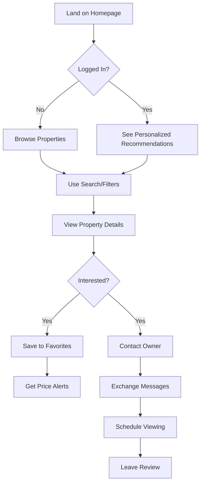
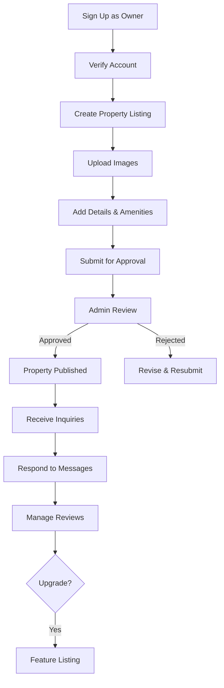

# 🏠 Production-Ready Rental Property Platform - Complete Laravel Guide (Part 3)

> **Final Part: Admin Dashboard, UI/UX, Security, SEO, Testing, MVP, Business Strategy & Deployment**

---

## 1️⃣8️⃣ Admin Dashboard

### 🛡️ Admin Dashboard Controller

```php
// app/Http/Controllers/Admin/DashboardController.php
namespace App\Http\Controllers\Admin;

use App\Http\Controllers\Controller;
use App\Models\Property;
use App\Models\User;
use App\Models\Review;
use App\Models\Report;
use Illuminate\Support\Facades\DB;

class AdminDashboardController extends Controller
{
    public function __construct()
    {
        $this->middleware(['auth', 'role:admin']);
    }

    public function index()
    {
        $stats = [
            'total_users' => User::count(),
            'total_properties' => Property::count(),
            'pending_properties' => Property::where('status', 'pending')->count(),
            'active_properties' => Property::where('status', 'approved')->where('is_active', true)->count(),
            'pending_reviews' => Review::where('is_approved', false)->count(),
            'pending_reports' => Report::where('status', 'pending')->count(),
            'total_revenue' => $this->calculateRevenue(),
        ];

        // Recent activities
        $recentProperties = Property::with('owner')->latest()->limit(10)->get();
        $recentUsers = User::latest()->limit(10)->get();
        $pendingReports = Report::with(['property', 'reporter'])->where('status', 'pending')->latest()->limit(10)->get();

        // Charts data
        $userGrowth = $this->getUserGrowthData();
        $propertyStats = $this->getPropertyStatsData();

        return view('admin.dashboard', compact(
            'stats',
            'recentProperties',
            'recentUsers',
            'pendingReports',
            'userGrowth',
            'propertyStats'
        ));
    }

    private function calculateRevenue(): float
    {
        // Calculate from featured listings, subscriptions, etc.
        return Property::where('is_featured', true)->sum('featured_price') ?? 0;
    }

    private function getUserGrowthData(): array
    {
        return User::select(
            DB::raw('DATE(created_at) as date'),
            DB::raw('COUNT(*) as count')
        )
        ->where('created_at', '>=', now()->subDays(30))
        ->groupBy('date')
        ->orderBy('date')
        ->get()
        ->pluck('count', 'date')
        ->toArray();
    }

    private function getPropertyStatsData(): array
    {
        return [
            'by_type' => Property::select('type', DB::raw('COUNT(*) as count'))
                ->groupBy('type')
                ->pluck('count', 'type')
                ->toArray(),
            'by_status' => Property::select('status', DB::raw('COUNT(*) as count'))
                ->groupBy('status')
                ->pluck('count', 'status')
                ->toArray(),
        ];
    }
}
```

### 🎮 Admin Property Management

```php
// app/Http/Controllers/Admin/PropertyController.php
namespace App\Http\Controllers\Admin;

use App\Http\Controllers\Controller;
use App\Models\Property;
use App\Services\PropertyService;
use Illuminate\Http\Request;

class PropertyController extends Controller
{
    public function __construct(
        private PropertyService $propertyService
    ) {
        $this->middleware(['auth', 'role:admin']);
    }

    public function index(Request $request)
    {
        $query = Property::with(['owner', 'images']);

        // Filter by status
        if ($request->has('status')) {
            $query->where('status', $request->status);
        }

        // Search
        if ($request->has('search')) {
            $query->where(function ($q) use ($request) {
                $q->where('title', 'like', '%' . $request->search . '%')
                  ->orWhere('city', 'like', '%' . $request->search . '%');
            });
        }

        $properties = $query->latest()->paginate(20);

        return view('admin.properties.index', compact('properties'));
    }

    public function approve(Property $property)
    {
        $this->propertyService->approveProperty($property->id);

        return back()->with('success', 'Property approved successfully');
    }

    public function reject(Request $request, Property $property)
    {
        $request->validate([
            'reason' => 'required|string|min:10'
        ]);

        $this->propertyService->rejectProperty($property->id, $request->reason);

        return back()->with('success', 'Property rejected');
    }

    public function destroy(Property $property)
    {
        $this->propertyService->deleteProperty($property->id);

        return back()->with('success', 'Property deleted successfully');
    }

    public function toggleFeatured(Property $property)
    {
        if ($property->is_featured) {
            $property->update([
                'is_featured' => false,
                'featured_until' => null
            ]);
            $message = 'Property removed from featured';
        } else {
            $this->propertyService->makeFeatured($property->id, 30);
            $message = 'Property featured for 30 days';
        }

        return back()->with('success', $message);
    }
}
```

### 📊 Admin Analytics Dashboard Blade

```blade
{{-- resources/views/admin/dashboard.blade.php --}}
@extends('layouts.admin')

@section('content')
<div class="container mx-auto px-4 py-8">
    <h1 class="text-3xl font-bold mb-8">Admin Dashboard</h1>

    {{-- Stats Cards --}}
    <div class="grid grid-cols-1 md:grid-cols-2 lg:grid-cols-4 gap-6 mb-8">
        <div class="bg-white rounded-lg shadow p-6">
            <div class="flex items-center justify-between">
                <div>
                    <p class="text-gray-500 text-sm">Total Users</p>
                    <p class="text-3xl font-bold">{{ number_format($stats['total_users']) }}</p>
                </div>
                <div class="bg-blue-100 p-3 rounded-full">
                    <svg class="w-8 h-8 text-blue-600" fill="none" stroke="currentColor" viewBox="0 0 24 24">
                        <path stroke-linecap="round" stroke-linejoin="round" stroke-width="2" d="M12 4.354a4 4 0 110 5.292M15 21H3v-1a6 6 0 0112 0v1zm0 0h6v-1a6 6 0 00-9-5.197M13 7a4 4 0 11-8 0 4 4 0 018 0z"></path>
                    </svg>
                </div>
            </div>
        </div>

        <div class="bg-white rounded-lg shadow p-6">
            <div class="flex items-center justify-between">
                <div>
                    <p class="text-gray-500 text-sm">Active Properties</p>
                    <p class="text-3xl font-bold">{{ number_format($stats['active_properties']) }}</p>
                </div>
                <div class="bg-green-100 p-3 rounded-full">
                    <svg class="w-8 h-8 text-green-600" fill="none" stroke="currentColor" viewBox="0 0 24 24">
                        <path stroke-linecap="round" stroke-linejoin="round" stroke-width="2" d="M3 12l2-2m0 0l7-7 7 7M5 10v10a1 1 0 001 1h3m10-11l2 2m-2-2v10a1 1 0 01-1 1h-3m-6 0a1 1 0 001-1v-4a1 1 0 011-1h2a1 1 0 011 1v4a1 1 0 001 1m-6 0h6"></path>
                    </svg>
                </div>
            </div>
        </div>

        <div class="bg-white rounded-lg shadow p-6">
            <div class="flex items-center justify-between">
                <div>
                    <p class="text-gray-500 text-sm">Pending Approval</p>
                    <p class="text-3xl font-bold text-orange-600">{{ number_format($stats['pending_properties']) }}</p>
                </div>
                <div class="bg-orange-100 p-3 rounded-full">
                    <svg class="w-8 h-8 text-orange-600" fill="none" stroke="currentColor" viewBox="0 0 24 24">
                        <path stroke-linecap="round" stroke-linejoin="round" stroke-width="2" d="M12 8v4l3 3m6-3a9 9 0 11-18 0 9 9 0 0118 0z"></path>
                    </svg>
                </div>
            </div>
        </div>

        <div class="bg-white rounded-lg shadow p-6">
            <div class="flex items-center justify-between">
                <div>
                    <p class="text-gray-500 text-sm">Pending Reports</p>
                    <p class="text-3xl font-bold text-red-600">{{ number_format($stats['pending_reports']) }}</p>
                </div>
                <div class="bg-red-100 p-3 rounded-full">
                    <svg class="w-8 h-8 text-red-600" fill="none" stroke="currentColor" viewBox="0 0 24 24">
                        <path stroke-linecap="round" stroke-linejoin="round" stroke-width="2" d="M12 9v2m0 4h.01m-6.938 4h13.856c1.54 0 2.502-1.667 1.732-3L13.732 4c-.77-1.333-2.694-1.333-3.464 0L3.34 16c-.77 1.333.192 3 1.732 3z"></path>
                    </svg>
                </div>
            </div>
        </div>
    </div>

    {{-- Charts --}}
    <div class="grid grid-cols-1 lg:grid-cols-2 gap-6 mb-8">
        <div class="bg-white rounded-lg shadow p-6">
            <h3 class="text-lg font-bold mb-4">User Growth (Last 30 Days)</h3>
            <canvas id="userGrowthChart"></canvas>
        </div>

        <div class="bg-white rounded-lg shadow p-6">
            <h3 class="text-lg font-bold mb-4">Properties by Type</h3>
            <canvas id="propertyTypeChart"></canvas>
        </div>
    </div>

    {{-- Recent Activities --}}
    <div class="grid grid-cols-1 lg:grid-cols-2 gap-6">
        <div class="bg-white rounded-lg shadow p-6">
            <h3 class="text-lg font-bold mb-4">Recent Properties</h3>
            <div class="space-y-3">
                @foreach($recentProperties as $property)
                    <div class="flex items-center justify-between border-b pb-3">
                        <div>
                            <p class="font-semibold">{{ $property->title }}</p>
                            <p class="text-sm text-gray-500">by {{ $property->owner->name }}</p>
                        </div>
                        <span class="px-3 py-1 rounded-full text-xs
                            @if($property->status === 'approved') bg-green-100 text-green-800
                            @elseif($property->status === 'pending') bg-orange-100 text-orange-800
                            @else bg-red-100 text-red-800
                            @endif">
                            {{ ucfirst($property->status) }}
                        </span>
                    </div>
                @endforeach
            </div>
        </div>

        <div class="bg-white rounded-lg shadow p-6">
            <h3 class="text-lg font-bold mb-4">Pending Reports</h3>
            <div class="space-y-3">
                @forelse($pendingReports as $report)
                    <div class="border-b pb-3">
                        <p class="font-semibold">{{ $report->property->title }}</p>
                        <p class="text-sm text-gray-600">Reason: {{ ucfirst($report->reason) }}</p>
                        <p class="text-xs text-gray-500">Reported by {{ $report->reporter->name }}</p>
                        <a href="{{ route('admin.reports.show', $report) }}"
                           class="text-blue-600 text-sm hover:underline">
                            Review →
                        </a>
                    </div>
                @empty
                    <p class="text-gray-500">No pending reports</p>
                @endforelse
            </div>
        </div>
    </div>
</div>

@push('scripts')
<script src="https://cdn.jsdelivr.net/npm/chart.js"></script>
<script>
// User Growth Chart
const userGrowthCtx = document.getElementById('userGrowthChart').getContext('2d');
new Chart(userGrowthCtx, {
    type: 'line',
    data: {
        labels: {!! json_encode(array_keys($userGrowth)) !!},
        datasets: [{
            label: 'New Users',
            data: {!! json_encode(array_values($userGrowth)) !!},
            borderColor: 'rgb(59, 130, 246)',
            backgroundColor: 'rgba(59, 130, 246, 0.1)',
            tension: 0.4
        }]
    },
    options: {
        responsive: true,
        maintainAspectRatio: false
    }
});

// Property Type Chart
const propertyTypeCtx = document.getElementById('propertyTypeChart').getContext('2d');
new Chart(propertyTypeCtx, {
    type: 'doughnut',
    data: {
        labels: {!! json_encode(array_keys($propertyStats['by_type'])) !!},
        datasets: [{
            data: {!! json_encode(array_values($propertyStats['by_type'])) !!},
            backgroundColor: [
                'rgb(59, 130, 246)',
                'rgb(16, 185, 129)',
                'rgb(245, 158, 11)',
                'rgb(239, 68, 68)'
            ]
        }]
    }
});
</script>
@endpush
@endsection
```

---

## 1️⃣9️⃣ UI/UX Design & Wireframes

### 🎨 Design System

#### Color Palette

```css
/* resources/css/design-system.css */
:root {
  /* Primary Colors */
  --color-primary-50: #eff6ff;
  --color-primary-500: #3b82f6;
  --color-primary-600: #2563eb;
  --color-primary-700: #1d4ed8;

  /* Neutral Colors */
  --color-gray-50: #f9fafb;
  --color-gray-100: #f3f4f6;
  --color-gray-500: #6b7280;
  --color-gray-900: #111827;

  /* Success */
  --color-success: #10b981;

  /* Warning */
  --color-warning: #f59e0b;

  /* Error */
  --color-error: #ef4444;

  /* Typography */
  --font-primary: "Inter", system-ui, sans-serif;
  --font-heading: "Poppins", sans-serif;

  /* Spacing */
  --spacing-xs: 0.25rem;
  --spacing-sm: 0.5rem;
  --spacing-md: 1rem;
  --spacing-lg: 1.5rem;
  --spacing-xl: 2rem;

  /* Border Radius */
  --radius-sm: 0.375rem;
  --radius-md: 0.5rem;
  --radius-lg: 0.75rem;

  /* Shadows */
  --shadow-sm: 0 1px 2px 0 rgb(0 0 0 / 0.05);
  --shadow-md: 0 4px 6px -1px rgb(0 0 0 / 0.1);
  --shadow-lg: 0 10px 15px -3px rgb(0 0 0 / 0.1);
}
```

### 📱 Wireframe Descriptions

#### **Home Page**

```
┌─────────────────────────────────────────────────────────┐
│ [Logo]              [Search] [Login] [Sign Up]          │
├─────────────────────────────────────────────────────────┤
│                                                          │
│         HERO SECTION                                     │
│         "Find Your Perfect Rental Home"                  │
│         [Search Bar: City | Type | Price | Search]       │
│                                                          │
├─────────────────────────────────────────────────────────┤
│  Featured Properties                                     │
│  ┌──────┐  ┌──────┐  ┌──────┐  ┌──────┐               │
│  │ Img  │  │ Img  │  │ Img  │  │ Img  │               │
│  │Title │  │Title │  │Title │  │Title │               │
│  │$1200 │  │$1500 │  │$980  │  │$2100 │               │
│  └──────┘  └──────┘  └──────┘  └──────┘               │
├─────────────────────────────────────────────────────────┤
│  Browse by City                                          │
│  [New York] [Los Angeles] [Chicago] [Houston]           │
├─────────────────────────────────────────────────────────┤
│  How It Works                                            │
│  1. Search  →  2. Contact  →  3. Move In                │
├─────────────────────────────────────────────────────────┤
│  Footer: Links | Social | Contact                       │
└─────────────────────────────────────────────────────────┘
```

#### **Search Results Page**

```
┌─────────────────────────────────────────────────────────┐
│ [Logo] [Search Bar]                    [User Menu]      │
├──────────────┬──────────────────────────────────────────┤
│ FILTERS      │  Search Results (245 properties)         │
│              │  Sort: [Newest ▼]                        │
│ City         │                                          │
│ ☑ New York   │  ┌────────────────────────────────────┐ │
│ ☐ LA         │  │ [Image]  Modern Apartment          │ │
│              │  │          $1,200/mo | 2BR | 1000sqft│ │
│ Type         │  │          New York, Manhattan       │ │
│ ☑ Apartment  │  │          ⭐ 4.5 (12 reviews) ♥     │ │
│ ☐ House      │  └────────────────────────────────────┘ │
│              │                                          │
│ Price        │  ┌────────────────────────────────────┐ │
│ [0]──[5000]  │  │ [Image]  Cozy Studio              │ │
│              │  │          $980/mo | Studio | 450sqft│ │
│ Bedrooms     │  │          Brooklyn, NY              │ │
│ ☐ 1+ ☑ 2+    │  │          ⭐ 4.8 (8 reviews) ♥      │ │
│              │  └────────────────────────────────────┘ │
│ Amenities    │                                          │
│ ☑ Parking    │  [Load More]                            │
│ ☐ Pet-friendly│                                         │
└──────────────┴──────────────────────────────────────────┘
```

#### **Property Detail Page**

```
┌─────────────────────────────────────────────────────────┐
│ [Logo] [Search]                        [User Menu]      │
├─────────────────────────────────────────────────────────┤
│ ┌───────────────────────────────────────────────────┐   │
│ │                                                   │   │
│ │         [Main Image Gallery]                     │   │
│ │         [Thumbnail] [Thumbnail] [Thumbnail]      │   │
│ │                                                   │   │
│ └───────────────────────────────────────────────────┘   │
├──────────────────────────────┬──────────────────────────┤
│ Modern 2BR Apartment         │  CONTACT OWNER           │
│ $1,200/month                 │  ┌────────────────────┐  │
│ 📍 Manhattan, New York       │  │ [Owner Avatar]     │  │
│ ⭐ 4.5 (12 reviews)          │  │ John Smith         │  │
│                              │  │ ✓ Verified         │  │
│ 🛏️ 2 Bedrooms | 🛁 1 Bath    │  │                    │  │
│ 📐 1000 sqft | 🏢 Floor 5    │  │ [Send Message]     │  │
│                              │  │ [Call Now]         │  │
│ Description:                 │  └────────────────────┘  │
│ Beautiful modern apartment...│                          │
│                              │  [♥ Save] [Share]        │
│ Amenities:                   │                          │
│ ✓ Parking ✓ WiFi ✓ AC       │                          │
│                              │                          │
│ [Interactive Map]            │                          │
│                              │                          │
│ Reviews (12)                 │                          │
│ ⭐⭐⭐⭐⭐ Great location!     │                          │
│                              │                          │
│ Similar Properties           │                          │
│ [Card] [Card] [Card]         │                          │
└──────────────────────────────┴──────────────────────────┘
```

#### **Owner Dashboard**

```
┌─────────────────────────────────────────────────────────┐
│ [Logo]                    [Notifications] [User Menu]   │
├──────────────┬──────────────────────────────────────────┤
│ Dashboard    │  My Properties                           │
│ My Properties│  ┌────────────────────────────────────┐  │
│ Messages (3) │  │ Modern Apartment    [Edit] [Delete]│  │
│ Reviews      │  │ Status: Approved    Views: 245     │  │
│ Settings     │  │ $1,200/mo          Favorites: 12   │  │
│              │  └────────────────────────────────────┘  │
│ [+ Add New]  │                                          │
│              │  ┌────────────────────────────────────┐  │
│              │  │ Cozy Studio         [Edit] [Delete]│  │
│              │  │ Status: Pending     Views: 0       │  │
│              │  │ $980/mo            Favorites: 0    │  │
│              │  └────────────────────────────────────┘  │
└──────────────┴──────────────────────────────────────────┘
```

### 🎯 UX Flow

#### **Renter Journey**



#### **Owner Journey**



---

## 2️⃣0️⃣ Security Best Practices

### 🔒 Security Implementation Checklist

#### **1. CSRF Protection** (Built-in Laravel)

```blade
{{-- All forms must include CSRF token --}}
<form method="POST" action="{{ route('properties.store') }}">
    @csrf
    {{-- form fields --}}
</form>
```

#### **2. XSS Prevention**

```blade
{{-- Always escape output --}}
{{ $property->title }} {{-- Escaped --}}
{!! $property->description !!} {{-- Unescaped - use with caution --}}

{{-- Use HTMLPurifier for user-generated HTML --}}
{!! clean($property->description) !!}
```

Install HTMLPurifier:

```bash
composer require mews/purifier
```

#### **3. SQL Injection Prevention**

```php
// ✅ GOOD - Using Eloquent/Query Builder
Property::where('city', $city)->get();

// ✅ GOOD - Using parameter binding
DB::select('SELECT * FROM properties WHERE city = ?', [$city]);

// ❌ BAD - Never do this
DB::select("SELECT * FROM properties WHERE city = '$city'");
```

#### **4. File Upload Validation**

```php
// app/Http/Requests/CreatePropertyRequest.php
public function rules(): array
{
    return [
        'images.*' => [
            'required',
            'image',
            'mimes:jpeg,png,jpg,webp',
            'max:5120', // 5MB
            'dimensions:min_width=800,min_height=600',
        ],
    ];
}
```

#### **5. Rate Limiting**

```php
// app/Http/Kernel.php
protected $middlewareGroups = [
    'web' => [
        // ...
        \Illuminate\Routing\Middleware\ThrottleRequests::class.':web',
    ],
];

// routes/web.php
Route::middleware(['throttle:10,1'])->group(function () {
    Route::post('/login', [AuthController::class, 'login']);
    Route::post('/register', [AuthController::class, 'register']);
});

// Custom rate limit for messages
Route::post('/messages', [MessageController::class, 'store'])
    ->middleware('throttle:20,1'); // 20 messages per minute
```

#### **6. Password Security**

```php
// config/auth.php - Already configured in Laravel
'passwords' => [
    'users' => [
        'provider' => 'users',
        'table' => 'password_reset_tokens',
        'expire' => 60,
        'throttle' => 60,
    ],
],
```

#### **7. Secure Headers**

```php
// app/Http/Middleware/SecurityHeaders.php
namespace App\Http\Middleware;

use Closure;

class SecurityHeaders
{
    public function handle($request, Closure $next)
    {
        $response = $next($request);

        $response->headers->set('X-Frame-Options', 'SAMEORIGIN');
        $response->headers->set('X-Content-Type-Options', 'nosniff');
        $response->headers->set('X-XSS-Protection', '1; mode=block');
        $response->headers->set('Referrer-Policy', 'strict-origin-when-cross-origin');
        $response->headers->set('Permissions-Policy', 'geolocation=(self), microphone=()');

        return $response;
    }
}
```

Register in `app/Http/Kernel.php`:

```php
protected $middleware = [
    // ...
    \App\Http\Middleware\SecurityHeaders::class,
];
```

#### **8. Environment Variables**

```env
# .env - Never commit this file
APP_ENV=production
APP_DEBUG=false
APP_KEY=base64:generated_key_here

DB_PASSWORD=strong_password_here
MAPBOX_TOKEN=your_token_here
```

#### **9. Input Sanitization**

```php
// app/Http/Requests/CreatePropertyRequest.php
protected function prepareForValidation()
{
    $this->merge([
        'title' => strip_tags($this->title),
        'description' => clean($this->description),
        'price' => abs($this->price),
    ]);
}
```

#### **10. Two-Factor Authentication** (Optional)

```bash
composer require laravel/fortify
php artisan fortify:install
php artisan migrate
```

---

## 2️⃣1️⃣ SEO Optimization

### 🔍 SEO Implementation

#### **1. Dynamic Meta Tags**

```php
// app/Http/Controllers/PropertyController.php
public function show(string $slug)
{
    $property = $this->propertyRepository->findBySlug($slug);

    // SEO Meta
    $meta = [
        'title' => $property->meta_title ?? $property->title . ' - Rental Property',
        'description' => $property->meta_description ?? Str::limit($property->description, 160),
        'image' => $property->primaryImage?->image_path,
        'url' => route('properties.show', $property->slug),
    ];

    return view('properties.show', compact('property', 'meta'));
}
```

```blade
{{-- resources/views/layouts/app.blade.php --}}
<head>
    <meta charset="UTF-8">
    <meta name="viewport" content="width=device-width, initial-scale=1.0">

    {{-- Basic SEO --}}
    <title>{{ $meta['title'] ?? config('app.name') }}</title>
    <meta name="description" content="{{ $meta['description'] ?? 'Find your perfect rental property' }}">

    {{-- Open Graph --}}
    <meta property="og:title" content="{{ $meta['title'] ?? config('app.name') }}">
    <meta property="og:description" content="{{ $meta['description'] ?? '' }}">
    <meta property="og:image" content="{{ $meta['image'] ?? asset('images/og-default.jpg') }}">
    <meta property="og:url" content="{{ $meta['url'] ?? url()->current() }}">
    <meta property="og:type" content="website">

    {{-- Twitter Card --}}
    <meta name="twitter:card" content="summary_large_image">
    <meta name="twitter:title" content="{{ $meta['title'] ?? config('app.name') }}">
    <meta name="twitter:description" content="{{ $meta['description'] ?? '' }}">
    <meta name="twitter:image" content="{{ $meta['image'] ?? asset('images/og-default.jpg') }}">

    {{-- Canonical URL --}}
    <link rel="canonical" href="{{ $meta['url'] ?? url()->current() }}">
</head>
```

#### **2. Structured Data (Schema.org)**

```blade
{{-- resources/views/properties/show.blade.php --}}
@push('scripts')
<script type="application/ld+json">
{
    "@context": "https://schema.org",
    "@type": "RealEstateListing",
    "name": "{{ $property->title }}",
    "description": "{{ $property->description }}",
    "url": "{{ route('properties.show', $property->slug) }}",
    "image": "{{ $property->primaryImage?->image_path }}",
    "address": {
        "@type": "PostalAddress",
        "streetAddress": "{{ $property->address }}",
        "addressLocality": "{{ $property->city }}",
        "postalCode": "{{ $property->postal_code }}"
    },
    "geo": {
        "@type": "GeoCoordinates",
        "latitude": "{{ $property->latitude }}",
        "longitude": "{{ $property->longitude }}"
    },
    "offers": {
        "@type": "Offer",
        "price": "{{ $property->price }}",
        "priceCurrency": "USD",
        "availability": "https://schema.org/InStock"
    },
    "aggregateRating": {
        "@type": "AggregateRating",
        "ratingValue": "{{ $property->average_rating }}",
        "reviewCount": "{{ $property->reviews_count }}"
    }
}
</script>
@endpush
```

#### **3. XML Sitemap**

```bash
composer require spatie/laravel-sitemap
```

```php
// app/Console/Commands/GenerateSitemap.php
namespace App\Console\Commands;

use Illuminate\Console\Command;
use Spatie\Sitemap\Sitemap;
use Spatie\Sitemap\Tags\Url;
use App\Models\Property;

class GenerateSitemap extends Command
{
    protected $signature = 'sitemap:generate';
    protected $description = 'Generate the sitemap';

    public function handle()
    {
        $sitemap = Sitemap::create();

        // Homepage
        $sitemap->add(Url::create('/')
            ->setLastModificationDate(now())
            ->setChangeFrequency(Url::CHANGE_FREQUENCY_DAILY)
            ->setPriority(1.0));

        // Properties
        Property::where('status', 'approved')
            ->where('is_active', true)
            ->get()
            ->each(function (Property $property) use ($sitemap) {
                $sitemap->add(Url::create(route('properties.show', $property->slug))
                    ->setLastModificationDate($property->updated_at)
                    ->setChangeFrequency(Url::CHANGE_FREQUENCY_WEEKLY)
                    ->setPriority(0.8));
            });

        $sitemap->writeToFile(public_path('sitemap.xml'));

        $this->info('Sitemap generated successfully!');
    }
}
```

Schedule it:

```php
// app/Console/Kernel.php
protected function schedule(Schedule $schedule)
{
    $schedule->command('sitemap:generate')->daily();
}
```

#### **4. Robots.txt**

```
# public/robots.txt
User-agent: *
Allow: /
Disallow: /admin/
Disallow: /dashboard/
Disallow: /messages/

Sitemap: https://yoursite.com/sitemap.xml
```

#### **5. Clean URLs**

```php
// ✅ GOOD
/properties/modern-apartment-manhattan
/search?city=new-york&type=apartment

// ❌ BAD
/properties/view?id=123
/search.php?q=apartment
```

---

## 2️⃣2️⃣ API Development

### 🔌 RESTful API

#### **API Routes**

```php
// routes/api.php
use App\Http\Controllers\Api\PropertyController;
use App\Http\Controllers\Api\AuthController;

Route::prefix('v1')->group(function () {
    // Public routes
    Route::post('/register', [AuthController::class, 'register']);
    Route::post('/login', [AuthController::class, 'login']);

    Route::get('/properties', [PropertyController::class, 'index']);
    Route::get('/properties/{property}', [PropertyController::class, 'show']);
    Route::get('/properties/search', [PropertyController::class, 'search']);

    // Protected routes
    Route::middleware('auth:sanctum')->group(function () {
        Route::post('/logout', [AuthController::class, 'logout']);

        Route::post('/properties', [PropertyController::class, 'store']);
        Route::put('/properties/{property}', [PropertyController::class, 'update']);
        Route::delete('/properties/{property}', [PropertyController::class, 'destroy']);

        Route::post('/favorites/{property}', [FavoriteController::class, 'store']);
        Route::delete('/favorites/{property}', [FavoriteController::class, 'destroy']);

        Route::get('/user', [AuthController::class, 'user']);
    });
});
```

#### **API Controller**

```php
// app/Http/Controllers/Api/PropertyController.php
namespace App\Http\Controllers\Api;

use App\Http\Controllers\Controller;
use App\Http\Resources\PropertyResource;
use App\Http\Resources\PropertyCollection;
use App\Models\Property;
use App\Services\PropertyService;
use Illuminate\Http\Request;

class PropertyController extends Controller
{
    public function __construct(
        private PropertyService $propertyService
    ) {}

    public function index()
    {
        $properties = Property::with(['owner', 'images'])
            ->where('status', 'approved')
            ->where('is_active', true)
            ->latest()
            ->paginate(15);

        return new PropertyCollection($properties);
    }

    public function show(Property $property)
    {
        $property->load(['owner', 'images', 'amenities', 'reviews']);

        return new PropertyResource($property);
    }

    public function store(Request $request)
    {
        $this->authorize('create', Property::class);

        $validated = $request->validate([
            'title' => 'required|string|max:255',
            'description' => 'required|string',
            'price' => 'required|numeric|min:0',
            // ... other validation rules
        ]);

        $property = $this->propertyService->createProperty(
            array_merge($validated, ['owner_id' => auth()->id()]),
            $request->file('images', [])
        );

        return new PropertyResource($property);
    }
}
```

#### **API Resource**

```php
// app/Http/Resources/PropertyResource.php
namespace App\Http\Resources;

use Illuminate\Http\Resources\Json\JsonResource;

class PropertyResource extends JsonResource
{
    public function toArray($request): array
    {
        return [
            'id' => $this->id,
            'title' => $this->title,
            'slug' => $this->slug,
            'description' => $this->description,
            'type' => $this->type,
            'price' => $this->price,
            'location' => [
                'address' => $this->address,
                'city' => $this->city,
                'district' => $this->district,
                'coordinates' => [
                    'latitude' => $this->latitude,
                    'longitude' => $this->longitude,
                ],
            ],
            'details' => [
                'bedrooms' => $this->bedrooms,
                'bathrooms' => $this->bathrooms,
                'area' => $this->area,
                'floor' => $this->floor,
                'furnishing' => $this->furnishing,
                'parking' => $this->parking,
                'pets_allowed' => $this->pets_allowed,
            ],
            'images' => $this->images->map(fn($img) => [
                'url' => $img->image_path,
                'thumbnail' => $img->thumbnail_path,
                'is_primary' => $img->is_primary,
            ]),
            'amenities' => $this->amenities->pluck('name'),
            'stats' => [
                'views' => $this->views_count,
                'favorites' => $this->favorites_count,
                'rating' => $this->average_rating,
                'reviews_count' => $this->reviews_count,
            ],
            'owner' => [
                'id' => $this->owner->id,
                'name' => $this->owner->name,
                'avatar' => $this->owner->avatar,
                'is_verified' => $this->owner->is_verified,
            ],
            'created_at' => $this->created_at->toIso8601String(),
            'updated_at' => $this->updated_at->toIso8601String(),
        ];
    }
}
```

---

## 2️⃣3️⃣ Testing Strategy

### 🧪 Testing Implementation

#### **Feature Test Example**

```php
// tests/Feature/PropertyTest.php
namespace Tests\Feature;

use App\Models\User;
use App\Models\Property;
use Illuminate\Foundation\Testing\RefreshDatabase;
use Tests\TestCase;

class PropertyTest extends TestCase
{
    use RefreshDatabase;

    public function test_user_can_view_property_listing()
    {
        $property = Property::factory()->create(['status' => 'approved']);

        $response = $this->get(route('properties.show', $property->slug));

        $response->assertStatus(200);
        $response->assertSee($property->title);
        $response->assertSee($property->price);
    }

    public function test_owner_can_create_property()
    {
        $owner = User::factory()->create();
        $owner->assignRole('owner');

        $response = $this->actingAs($owner)->post(route('properties.store'), [
            'title' => 'Test Property',
            'description' => 'This is a test property description that is long enough.',
            'type' => 'apartment',
            'price' => 1200,
            'city' => 'New York',
            'address' => '123 Test St',
            'bedrooms' => 2,
            'bathrooms' => 1,
            'area' => 1000,
            'furnishing' => 'furnished',
        ]);

        $response->assertRedirect();
        $this->assertDatabaseHas('properties', [
            'title' => 'Test Property',
            'owner_id' => $owner->id,
        ]);
    }

    public function test_renter_cannot_create_property()
    {
        $renter = User::factory()->create();
        $renter->assignRole('renter');

        $response = $this->actingAs($renter)->post(route('properties.store'), [
            'title' => 'Test Property',
            // ... other fields
        ]);

        $response->assertForbidden();
    }
}
```

#### **Unit Test Example**

```php
// tests/Unit/PropertyServiceTest.php
namespace Tests\Unit;

use App\Models\Property;
use App\Services\PropertyService;
use Tests\TestCase;

class PropertyServiceTest extends TestCase
{
    public function test_get_similar_properties_returns_correct_results()
    {
        $property = Property::factory()->create([
            'city' => 'New York',
            'type' => 'apartment',
            'price' => 1200,
        ]);

        // Create similar properties
        Property::factory()->count(5)->create([
            'city' => 'New York',
            'type' => 'apartment',
            'price' => 1300,
            'status' => 'approved',
        ]);

        $service = app(PropertyService::class);
        $similar = $service->getSimilarProperties($property, 3);

        $this->assertCount(3, $similar);
        $this->assertEquals('New York', $similar->first()->city);
    }
}
```

---

## 2️⃣4️⃣ MVP Definition

### 🎯 Minimum Viable Product Scope

#### **Phase 1: Core MVP (Weeks 1-4)**

**Essential Features Only:**

1. ✅ User Registration & Login (Email/Password)
2. ✅ Role System (Owner/Renter)
3. ✅ Property Listings (CRUD)
4. ✅ Image Upload (Max 10 images)
5. ✅ Basic Search & Filters (City, Type, Price, Bedrooms)
6. ✅ Property Detail Page
7. ✅ Contact Form (Email notification)
8. ✅ Favorites System
9. ✅ Basic Admin Panel (Approve/Reject listings)

**Excluded from MVP:**

- ❌ Social Login
- ❌ Real-time Messaging
- ❌ Reviews & Ratings
- ❌ Advanced Recommendations
- ❌ Payment Integration
- ❌ Email Alerts
- ❌ Saved Searches
- ❌ Map Integration (Add in Phase 2)

---

## 2️⃣5️⃣ Development Timeline

### 📅 4-Week MVP Timeline

#### **Week 1: Foundation**

- Day 1-2: Project setup, database design, migrations
- Day 3-4: Authentication system, role management
- Day 5-7: Property model, basic CRUD, image upload

#### **Week 2: Core Features**

- Day 8-10: Search & filtering system
- Day 11-12: Property detail page, favorites
- Day 13-14: Admin panel basics

#### **Week 3: UI/UX**

- Day 15-17: Homepage, search results page
- Day 18-19: Property detail page design
- Day 20-21: Dashboard, forms, responsive design

#### **Week 4: Testing & Launch**

- Day 22-24: Testing, bug fixes
- Day 25-26: SEO optimization, performance tuning
- Day 27-28: Deployment, final testing

---

## 2️⃣6️⃣ Monetization Strategy

### 💰 Revenue Streams

#### **1. Featured Listings** ($29-$99/month)

- Highlighted in search results
- Homepage placement
- "Featured" badge
- Priority in recommendations

#### **2. Owner Subscriptions**

- **Basic**: Free (1 listing, standard support)
- **Pro**: $19/month (5 listings, priority support, analytics)
- **Premium**: $49/month (Unlimited listings, featured placement, advanced analytics)

#### **3. Commission Model**

- 5-10% commission on successful rentals
- Verified through renter confirmation

#### **4. Premium Services**

- Professional photography: $99
- Virtual tours: $149
- Property verification: $29

---

## 2️⃣7️⃣ Product Roadmap

### 🗺️ Future Phases

#### **Phase 2: Enhanced Features (Months 2-3)**

- Map integration (Mapbox)
- Reviews & ratings system
- In-app messaging
- Email notifications
- Saved searches with alerts

#### **Phase 3: Monetization (Months 4-5)**

- Payment integration (Stripe)
- Subscription plans
- Featured listings
- Analytics dashboard

#### **Phase 4: Advanced Features (Months 6-8)**

- AI-powered recommendations
- Virtual tours
- Mobile app (React Native)
- Multi-language support
- Advanced analytics

#### **Phase 5: Scale (Months 9-12)**

- Multi-city expansion
- API for third-party integrations
- White-label solution
- Enterprise features

---

## 2️⃣8️⃣ Deployment & DevOps

### 🚀 Production Deployment

#### **Server Requirements**

```
- Ubuntu 22.04 LTS
- PHP 8.2+
- Nginx
- PostgreSQL 15+
- Redis
- Node.js 18+
```

#### **Deployment Script**

```bash
#!/bin/bash

# Update system
sudo apt update && sudo apt upgrade -y

# Install PHP 8.2
sudo apt install -y php8.2-fpm php8.2-cli php8.2-pgsql php8.2-mbstring \
    php8.2-xml php8.2-curl php8.2-zip php8.2-gd php8.2-redis

# Install Composer
curl -sS https://getcomposer.org/installer | php
sudo mv composer.phar /usr/local/bin/composer

# Install PostgreSQL
sudo apt install -y postgresql postgresql-contrib

# Install Redis
sudo apt install -y redis-server

# Install Nginx
sudo apt install -y nginx

# Clone repository
cd /var/www
git clone https://github.com/yourrepo/rental-platform.git
cd rental-platform

# Install dependencies
composer install --optimize-autoloader --no-dev
npm install && npm run build

# Setup environment
cp .env.example .env
php artisan key:generate

# Run migrations
php artisan migrate --force

# Setup permissions
sudo chown -R www-data:www-data /var/www/rental-platform
sudo chmod -R 755 /var/www/rental-platform/storage

# Setup supervisor for queues
sudo apt install -y supervisor
```

#### **Nginx Configuration**

```nginx
server {
    listen 80;
    server_name yoursite.com;
    root /var/www/rental-platform/public;

    add_header X-Frame-Options "SAMEORIGIN";
    add_header X-Content-Type-Options "nosniff";

    index index.php;

    charset utf-8;

    location / {
        try_files $uri $uri/ /index.php?$query_string;
    }

    location = /favicon.ico { access_log off; log_not_found off; }
    location = /robots.txt  { access_log off; log_not_found off; }

    error_page 404 /index.php;

    location ~ \.php$ {
        fastcgi_pass unix:/var/run/php/php8.2-fpm.sock;
        fastcgi_param SCRIPT_FILENAME $realpath_root$fastcgi_script_name;
        include fastcgi_params;
    }

    location ~ /\.(?!well-known).* {
        deny all;
    }
}
```

#### **SSL Setup**

```bash
sudo apt install -y certbot python3-certbot-nginx
sudo certbot --nginx -d yoursite.com -d www.yoursite.com
```

#### **Queue Worker (Supervisor)**

```ini
[program:rental-platform-worker]
process_name=%(program_name)s_%(process_num)02d
command=php /var/www/rental-platform/artisan queue:work redis --sleep=3 --tries=3 --max-time=3600
autostart=true
autorestart=true
stopasgroup=true
killasgroup=true
user=www-data
numprocs=4
redirect_stderr=true
stdout_logfile=/var/www/rental-platform/storage/logs/worker.log
stopwaitsecs=3600
```

---

## 🎉 Conclusion

This comprehensive guide provides everything needed to build a **production-ready rental property platform** using Laravel. The architecture is scalable, secure, and follows industry best practices.

### Key Takeaways:

- ✅ **Modular Architecture**: Service layer, repositories, clean separation
- ✅ **Security First**: CSRF, XSS, SQL injection protection, rate limiting
- ✅ **SEO Optimized**: Meta tags, sitemaps, structured data
- ✅ **Scalable**: Ready for growth with proper caching, queues
- ✅ **User-Centric**: Clean UX, mobile-responsive, fast
- ✅ **Business Ready**: Multiple monetization strategies

### Next Steps:

1. Set up development environment
2. Create database and run migrations
3. Build MVP features (4 weeks)
4. Test thoroughly
5. Deploy to production
6. Iterate based on user feedback

**Good luck with your rental platform! 🚀**
